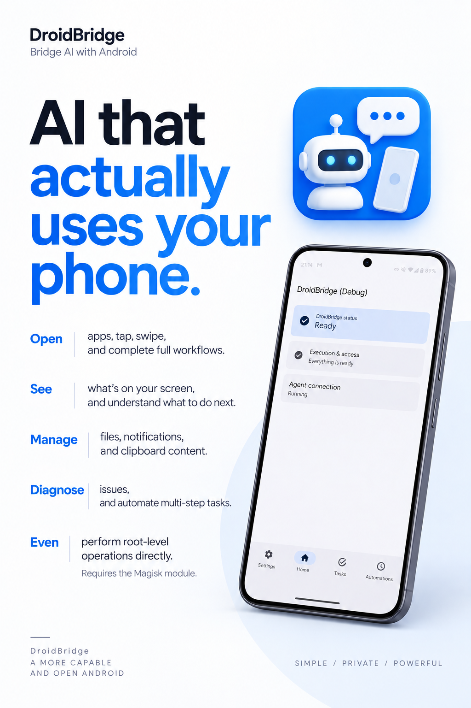
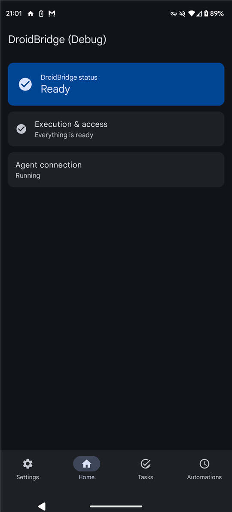
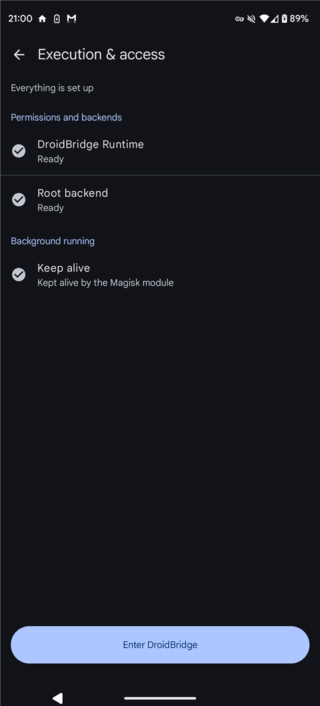
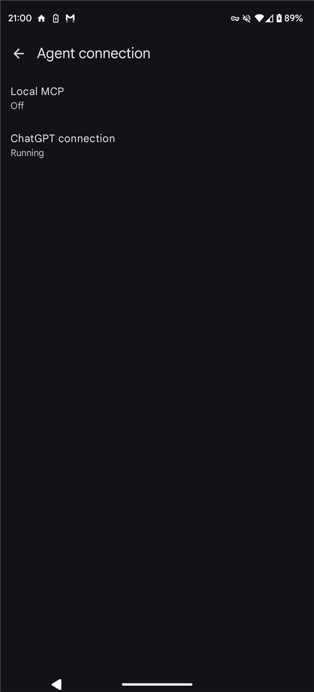
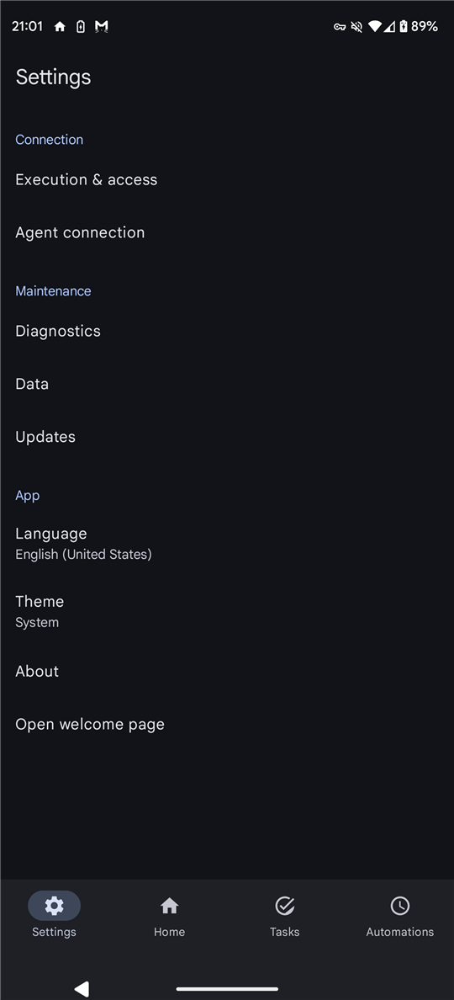

<p align="center">
  
</p>

<h1 align="center">DroidBridge</h1>

<p align="center">
  <b>An on-device MCP server for Android.</b><br>
  Let ChatGPT and local AI agents actually operate your phone — no PC, no ADB.
</p>

<p align="center">
  <a href="LICENSE"></a>
  
  
  
  <a href="https://github.com/zephyr7030/DroidBridge/releases/latest"></a>
</p>

<p align="center">
  <b>English</b> · <a href="README.zh-CN.md">简体中文</a>
</p>

<p align="center">
  
</p>

## What it is

DroidBridge runs a [Model Context Protocol](https://modelcontextprotocol.io) server **inside your phone**.
An AI agent connected to it can see the screen, tap and type, manage files, run commands, use the
clipboard and notifications, diagnose the network and schedule automations — with exactly the
permissions you granted on the device, and nothing more.

Two ways to connect, side by side:

| Connection | For | How it reaches the phone |
|---|---|---|
| **ChatGPT** | ChatGPT on the web (developer mode) | OpenAI's Secure MCP Tunnel. The phone polls OpenAI over HTTPS; no port is opened and no public address is needed. |
| **Local MCP** | Agents on the same device, or on a computer over `adb forward` | Streamable HTTP on `127.0.0.1:8765/mcp` with a bearer token. |

## What an agent can do

| Tool | What it covers |
|---|---|
| `context` | DroidBridge status, capabilities and the tool catalog |
| `visual` | Observe the screen (image and UI hierarchy), tap, long-press, swipe, type text, press keys and key combinations |
| `android` | Inspect packages, launch apps and intents, clipboard, notifications |
| `filesystem` | Inspect, read, write, edit, move, delete, archive (ZIP) and download files |
| `command` | Run shell commands as the app, shell (Shizuku) or root (Magisk) identity |
| `network` | Diagnose DNS, TCP and TLS; capture and inject traffic (root) |
| `automation` | Create, update, enable and delete automations that run on a schedule |
| `task_control` | List, inspect and cancel background tasks |

Every tool carries MCP safety annotations (`readOnlyHint`, `destructiveHint`, `openWorldHint`), so
clients such as ChatGPT ask you to confirm actions that change things.

## Choose your privilege level

DroidBridge works on an ordinary phone and unlocks more when you give it more:

| | No root | + Shizuku | + Magisk module |
|---|---|---|---|
| Screen observe / tap / type | Accessibility service | ✓ (typing: ASCII¹) | ✓ |
| Screen capture | Screen-capture consent | ✓ | ✓ |
| Notifications | Notification access | Notification access | ✓ |
| Shell commands | App identity | Shell identity | Root identity |
| Network capture / injection | — | — | ✓ |
| Stays alive in the background | Battery and autostart settings | Kept alive until the next reboot | Kept alive, restored after reboot |

¹ Over Shizuku, text beyond ASCII (Chinese, emoji) needs the accessibility service or the Magisk module.

The in-app **Execution & access** page walks you through each switch with a button that opens the
right system page, and tells you when something is already covered by a stronger backend.

## Requirements

- Android 13 to 17 on an **arm64-v8a** device.
- For ChatGPT: a plan with web developer mode (Plus or higher), a Secure MCP Tunnel and a Runtime
  API key from the OpenAI platform.
- Optional: [Shizuku](https://shizuku.rikka.app/) or [Magisk](https://github.com/topjohnwu/Magisk)
  for the higher privilege levels.

## Install

1. Download `droidbridge-<version>-arm64-v8a.apk` from
   [Releases](https://github.com/zephyr7030/DroidBridge/releases/latest) and install it.
2. *(Optional, rooted phones)* Download `droidbridge-magisk-<version>.zip`, install it in the Magisk
   app, and reboot.
3. Open DroidBridge. The first-run guide asks which agent you use and walks through permissions.

Each release ships a `SHA256SUMS.txt` and a signed `release.json`; the app uses the signature to
verify its own updates.

## Connect ChatGPT

1. On [platform.openai.com](https://platform.openai.com/settings/organization/tunnels) create a
   Secure MCP Tunnel, and an [API key](https://platform.openai.com/api-keys) allowed to use it.
2. In DroidBridge open **Agent connection → ChatGPT connection**, paste the Tunnel ID and the key,
   and turn the tunnel on. The key is encrypted with the Android Keystore and never shown again.
3. On a computer browser, open ChatGPT settings, enable developer mode, and create a connector with
   the **Tunnel** connection type pointing at your tunnel. The app page has buttons for both pages.
4. Ask ChatGPT to use DroidBridge. The first call shows up in the app.

## Connect a local agent

1. In DroidBridge open **Agent connection → Local MCP**, turn it on and copy the token.
2. Point your MCP client at `http://127.0.0.1:8765/mcp` with `Authorization: Bearer <token>`.
   From a computer, forward the port first:

   ```bash
   adb forward tcp:8765 tcp:8765
   ```

## Screenshots

| Home | Execution & access | Agent connection | Settings |
|---|---|---|---|
|  |  |  |  |

## Security and privacy

- Everything runs on the phone. DroidBridge has no server of its own and sends no telemetry.
- An agent gets **exactly** the access you granted on the device; there is no extra remote
  permission layer to misconfigure. Only connect agents you trust with that access.
- The ChatGPT tunnel speaks only to `api.openai.com` over TLS with a pinned WebPKI root store.
- The local MCP endpoint listens on loopback only and requires its bearer token.
- Text that the system `input` command cannot type (for example Chinese or emoji) is pasted
  through the clipboard: the clip is marked sensitive and your previous clipboard is restored.

Please report vulnerabilities privately as described in [SECURITY.md](SECURITY.md).

## Build from source

The build is pinned and currently scripted for Windows with PowerShell 7:

- JDK 17, Android SDK platform 37, Build Tools 36.0.0, NDK 29.0.14206865, CMake 3.31.6
- Rust 1.98.0 (`rust/rust-toolchain.toml`) and `cargo-ndk` 4.1.2
- libpcap 1.10.6 for the root network tools: `pwsh tools/build-libpcap.ps1`

```bash
./gradlew :app:assembleDebug :app:assembleDebugMagiskModule
```

`pwsh tools/check-toolchain.ps1` verifies the toolchain. See [CONTRIBUTING.md](CONTRIBUTING.md).

## License

DroidBridge is licensed under the [Apache License 2.0](LICENSE). Third-party components and their
licenses are listed in [THIRD_PARTY_NOTICES.txt](THIRD_PARTY_NOTICES.txt).

DroidBridge is an independent project and is not affiliated with or endorsed by OpenAI, Anthropic,
Google, Magisk or Shizuku. Product names are trademarks of their respective owners.
