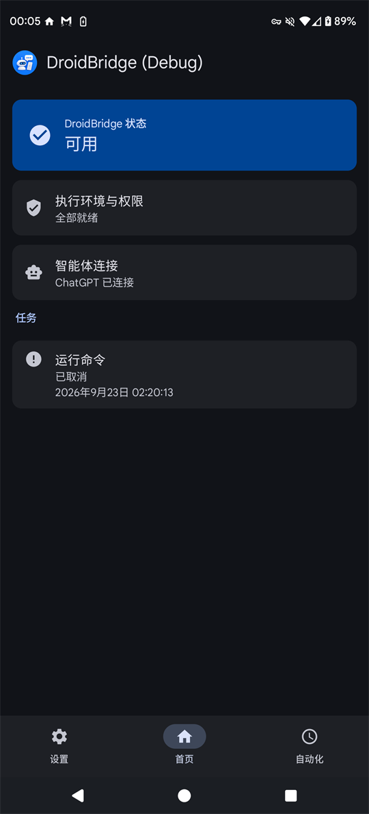
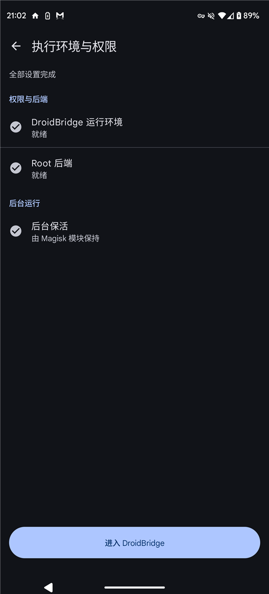
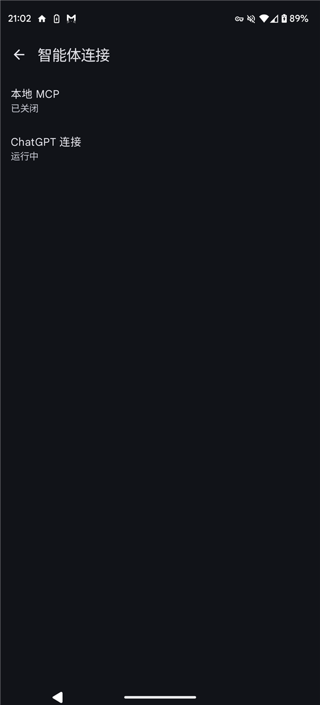
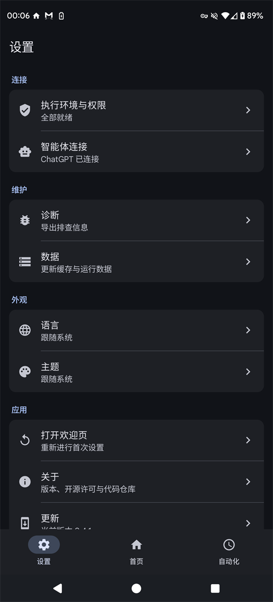

<p align="center">
  
</p>

<h1 align="center">卓爱桥 DroidBridge</h1>

<p align="center">
  <b>运行在手机上的 Android MCP 服务器。</b><br>
  让 ChatGPT 和本地 AI 智能体真正操作你的手机——不需要电脑，不需要 ADB。
</p>

<p align="center">
  <a href="LICENSE"></a>
  
  
  
  <a href="https://github.com/zephyr7030/DroidBridge/releases/latest"></a>
</p>

<p align="center">
  <a href="README.md">English</a> · <b>简体中文</b>
</p>

<p align="center">
  
</p>

## 这是什么

卓爱桥在**手机内部**运行一个 [Model Context Protocol（MCP）](https://modelcontextprotocol.io) 服务器。
连上它的 AI 智能体可以看屏幕、点击和输入、管理文件、运行命令、读写剪贴板和通知、诊断网络、设置定时自动化——
权限完全等于你在手机上授予的范围，不多也不少。

两种连接方式并列：

| 连接方式 | 适用于 | 如何到达手机 |
|---|---|---|
| **ChatGPT** | 网页版 ChatGPT（开发者模式） | OpenAI 官方安全隧道（Secure MCP Tunnel）。手机通过 HTTPS 主动向 OpenAI 取任务，不开放端口，也不需要公网地址。 |
| **本地 MCP** | 同一台手机上的智能体，或通过 `adb forward` 连接的电脑 | `127.0.0.1:8765/mcp` 上的 Streamable HTTP，使用 Bearer 令牌。 |

## 智能体能做什么

| 工具 | 覆盖范围 |
|---|---|
| `context` | 卓爱桥状态、能力和工具目录 |
| `visual` | 观察屏幕（截图和界面层级）、点击、长按、滑动、输入文字、按键和组合键 |
| `android` | 查看应用、启动应用和 Intent、剪贴板、通知 |
| `filesystem` | 查看、读取、写入、编辑、移动、删除、ZIP 打包解包、下载文件 |
| `command` | 以应用、Shell（Shizuku）或 Root（root 模块）身份运行命令 |
| `network` | DNS、TCP、TLS 诊断；抓包和注入流量（需 Root） |
| `automation` | 创建、修改、启用、删除按计划运行的自动化 |
| `task_control` | 列出、查看、取消后台任务 |

每个工具都带有 MCP 安全标注（`readOnlyHint`、`destructiveHint`、`openWorldHint`），ChatGPT 等客户端会在执行改动类操作前请你确认。

## 选择权限档位

普通手机就能用，给的权限越多，能做的越多：

| | 无 Root | + Shizuku | + Root 模块（Magisk / KernelSU / APatch） |
|---|---|---|---|
| 看屏幕 / 点击 / 输入 | 无障碍服务 | ✓（输入：仅 ASCII¹） | ✓ |
| 截屏 | 屏幕捕获授权 | ✓ | ✓ |
| 通知 | 通知使用权 | 通知使用权 | ✓ |
| Shell 命令 | 应用身份 | Shell 身份 | Root 身份 |
| 抓包 / 注入 | — | — | ✓ |
| 后台保活 | 电池与自启动设置 | 保持到下次重启 | 保持，重启后自动恢复 |

¹ 通过 Shizuku 时，中文、Emoji 等非 ASCII 文字需要无障碍服务或 root 模块。

App 内的 **执行环境与权限** 页会逐项引导：每一项都有直达对应系统设置的按钮，已被更强后端覆盖的项目会自动隐藏。

## 系统要求

- Android 13 到 17，**arm64-v8a** 设备。
- 连接 ChatGPT：需要支持网页开发者模式的套餐（Plus 及以上），以及在 OpenAI 平台创建的安全隧道和 Runtime API Key。
- 可选：[Shizuku](https://shizuku.rikka.app/)，以及 [Magisk](https://github.com/topjohnwu/Magisk)、[KernelSU](https://github.com/tiann/KernelSU) 或 [APatch](https://github.com/bmax121/APatch)，用于更高权限档位。

## 安装

1. 在 [Releases](https://github.com/zephyr7030/DroidBridge/releases/latest) 下载 `droidbridge-<版本>-arm64-v8a.apk` 并安装。
2. *（可选，已 Root 的手机）* 下载 `droidbridge-magisk-<版本>.zip`，在 Magisk、KernelSU 或 APatch 中安装模块并重启。
3. 打开卓爱桥，首次启动引导会让你选择智能体类型，并逐项完成权限设置。

每个版本都附带 `SHA256SUMS.txt` 和签名的 `release.json`，App 自身更新时会校验签名。

## 连接 ChatGPT

1. 在 [OpenAI 平台](https://platform.openai.com/settings/organization/tunnels) 创建安全隧道，并创建一个可使用该隧道的 [API Key](https://platform.openai.com/api-keys)。
2. 在卓爱桥打开 **智能体连接 → ChatGPT 连接**，粘贴 Tunnel ID 和 Key，打开隧道。Key 由 Android Keystore 加密保存，之后不再显示。
3. 在电脑浏览器打开 ChatGPT 设置，开启开发者模式，新建连接器，连接方式选择 **Tunnel** 并选中你的隧道。App 页面上有这两个页面的直达按钮。
4. 让 ChatGPT 使用卓爱桥，第一次调用会显示在 App 里。

## 连接本地智能体

1. 在卓爱桥打开 **智能体连接 → 本地 MCP**，打开并复制令牌。
2. 让 MCP 客户端连接 `http://127.0.0.1:8765/mcp`，请求头 `Authorization: Bearer <令牌>`。从电脑连接时先转发端口：

   ```bash
   adb forward tcp:8765 tcp:8765
   ```

## 截图

| 首页 | 执行环境与权限 | 智能体连接 | 设置 |
|---|---|---|---|
|  |  |  |  |

## 安全与隐私

- 一切都在手机上运行。卓爱桥没有自己的服务器，也不上传任何统计数据。
- 智能体获得的权限**恰好**等于你在手机上授予的权限，没有额外的远程权限层可能配错。请只连接你信任的智能体。
- ChatGPT 隧道只通过 TLS 与 `api.openai.com` 通信，使用固定的 WebPKI 根证书库。
- 本地 MCP 只监听本机回环地址，必须携带令牌。
- 系统 `input` 命令无法输入的文字（例如中文、Emoji）会通过剪贴板粘贴：写入时标记为敏感内容，粘贴后恢复你原来的剪贴板。

发现安全问题请按 [SECURITY.md](SECURITY.md) 私下报告。

## 从源码构建

构建环境是固定版本，目前脚本面向 Windows + PowerShell 7：

- JDK 17、Android SDK platform 37、Build Tools 36.0.0、NDK 29.0.14206865、CMake 3.31.6
- Rust 1.98.0（见 `rust/rust-toolchain.toml`）和 `cargo-ndk` 4.1.2
- Root 网络工具需要 libpcap 1.10.6：`pwsh tools/build-libpcap.ps1`

```bash
./gradlew :app:assembleDebug :app:assembleDebugMagiskModule
```

`pwsh tools/check-toolchain.ps1` 可检查工具链。详见 [CONTRIBUTING.md](CONTRIBUTING.md)。

## 许可证

卓爱桥以 [Apache License 2.0](LICENSE) 授权。第三方组件及其许可证见 [THIRD_PARTY_NOTICES.txt](THIRD_PARTY_NOTICES.txt)。

卓爱桥是独立项目，与 OpenAI、Anthropic、Google、Magisk、Shizuku 均无隶属或背书关系。文中产品名称归各自所有者所有。
